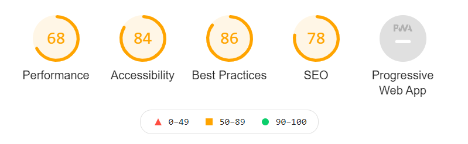

# Projet La Chouette Agence

date de début: 30/11/2020

## Projet 4 du parcours développeur web d'Openclassrooms

### Objectif: Optimisez un site web existant

Optimiser un site web existant pour le rendre plus accessible
Générer un audit du site d'un point de vue SEO et Accessibilité et en tirer 10 recommandations.
Mettre en place ces 10 recommandations et démontrer l'impact de ces recommandations en comparant les résultats dans un rapport d'optimisation.

**Ce repository permet de mettre en ligne et d'analyser le site dans sa version initiale.**

Le site optimisé est stocké sur cet autre repository: https://github.com/MarionLauzier/_4_30112020_optimised et est accessible à l'adresse : https://marionlauzier.github.io/_4_30112020_optimised/

 
    Résultat de l'audit avec l'outil Lighthouse: 
     

